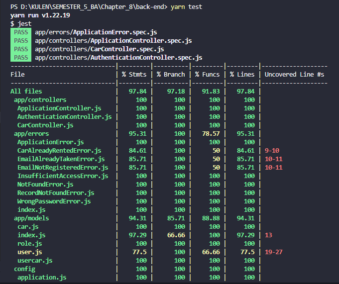

# Binar Car Rental API

Nanda Julian Lubis.

Binar car rental API is chapter 8 challnge from Binar Academy, this challenge contain binar car rental api with unit test and deployment 

## Tech
- ExpressJS - NodeJS HTTP Server Framework

## How to install project
- Download or clone the repository
- install dependencies in frontend and backend with "npm install" or "yarn"
- configure your postgres user in config/database.js
- run "sequelize db:create" to create database
- run "sequelize db:migrate" to migrate table
- run "sequelize db:seed:all" to seeding data
- run "npm run start" or "yarn start" to run project

## Live Demo
Or you can see a live demo here https://challenge-08-binar-production.up.railway.app

## Unit Test

##### Thank's for your visit